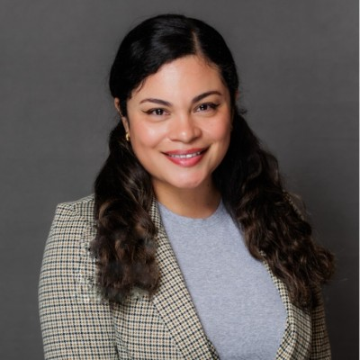
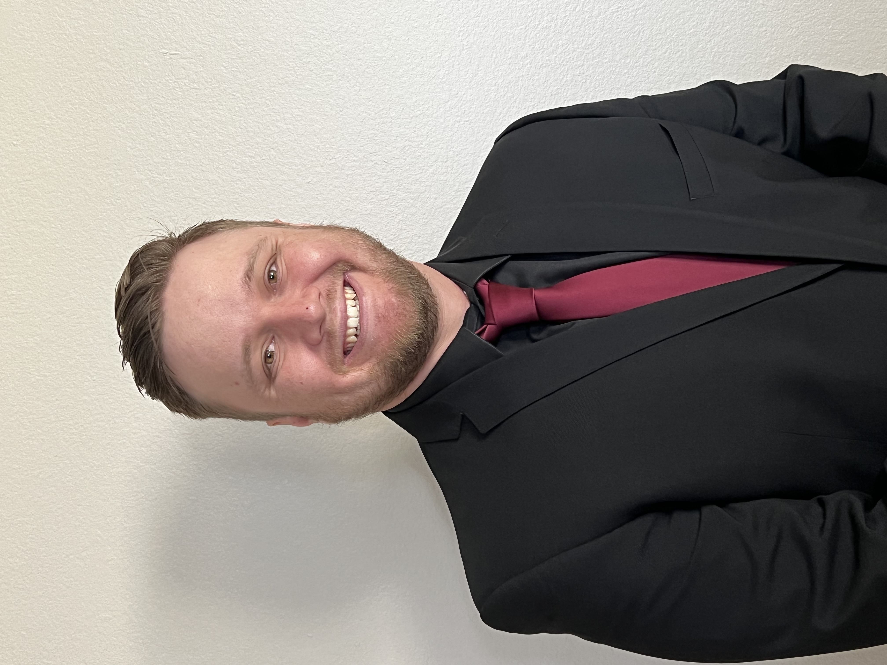

# Signal for the Silent  

## Pilar De Haro

  

  

    

      Data analyst with experience across media, tech, and marketing, with a strong track record in dashboard development, campaign analysis, and privacy compliance. Adept at translating complex data into insights that drive strategic decisions.
    

  

## Bret Clemetson

  

  

    

      Sports Data Analyst passionate about bridging old and new school philosophies through data. Skilled in modeling tools and visualizations to drive modern insights.
    

  

## Tallal Moshrif

  

  

    

      Cloud focused data engineer with experience across SQL development, ETL pipelines, and Azure based solutions, with a strong track record in data integration and dashboarding. Adept at transforming complex datasets into actionable insights that support business strategy.
    

  

## Kasey Vo

  

  

    

      Sports Analyst at a Unified School district helping to improve high school sport outcomes.
    

  

